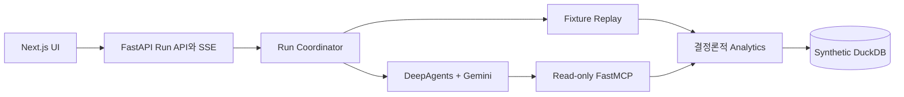

# Signal Trace — Customer Journey Intelligence Demo

한국어 질문으로 합성 고객 데이터를 분석하고, Agent 실행 Trace부터 Insight,
고객 Journey, 마스킹 Evidence까지 한 화면에서 확인하는 로컬 워킹 데모입니다.

> 이 프로젝트는 `seed=20260819`로 만든 합성 고객 30명만 사용합니다. 실제 고객
> 데이터, 운영 Connector, CRM 작업 기능은 포함하지 않으며 운영 용도로 사용할 수
> 없습니다.

## 데모에서 확인할 수 있는 것

- 질문: `AI 검색 실패 후 고객센터까지 문의한 고객이 얼마나 돼?`
- 분석 범위: `2026-07-20 00:00:00+09:00` 이상,
  `2026-08-19 00:00:00+09:00` 미만
- 패턴: 검색 실패 → 24시간 내 같은 Topic 재검색 → 첫 실패 후 72시간 내 VOC
- 전체 Source 결과: 정확히 `6명`
- VOC를 끈 결과: 완전한 패턴 `0명`과 Source 제한 안내

종료일은 미포함(exclusive)입니다. UI의 기본 종료일 `2026-08-19`는
`2026-08-18` 하루 전체까지 포함합니다.

## 구조



수치, 고객 매칭, Risk Score, Evidence 선택은 DuckDB 기반 Analytics가 계산합니다.
Gemini는 Tool 선택과 설명을 담당하며, 최종 결과는 같은 Run의 Tool 사실과 다시
검증됩니다.

## 준비 사항

- Python `3.12`
- [uv](https://docs.astral.sh/uv/)
- Node.js `20.18.1` 이상과 npm
- GNU Make 또는 macOS Make

최초 한 번 다음 명령을 실행합니다. Python/Node 의존성과 Playwright Chromium까지
설치합니다.

```bash
make setup
```

## 빠른 시작

```bash
make seed
make dev
```

브라우저에서 [http://127.0.0.1:3000](http://127.0.0.1:3000)을 엽니다.
`make dev`는 Backend와 Frontend를 함께 실행하며 `Ctrl-C`, `INT`, `TERM`을 받으면
두 프로세스를 모두 종료합니다.

Gemini를 사용하려면 저장소 루트 `.env`에 키를 둡니다. 이미 `.env`가 있다면
덮어쓰면 안 됩니다.

```dotenv
AGENT_MODE=auto
GEMINI_API_KEY=your_key_here
GEMINI_MODEL=gemini-3.7-flash
GEMINI_FALLBACK_MODEL=gemini-3.6-flash
```

새 설정 파일이 필요할 때만 `backend/.env.example`을 저장소 루트 `.env`로
복사합니다. 키는 서버 프로세스에서만 읽으며 Frontend로 전달하지 않습니다.

## Agent 모드

| 실행 | 동작 |
| --- | --- |
| `make dev` | `auto` 모드. 키가 있으면 Gemini 실행, 키 누락이나 Provider 오류 또는 검증 실패 시 공개 Trace를 남기고 Fixture로 전환 |
| `make dev-fixture` | API 키와 외부 네트워크 없이 결정론적 Fixture만 실행 |
| `make dev-gemini` | Gemini만 실행. 키 누락이나 Provider 실패를 명시적 Run 오류로 표시 |

Gemini 기본 모델은 `gemini-3.7-flash`입니다. 기본 모델이 Tool 호출 전에
`NOT_FOUND`를 반환할 때만 대체 모델 `gemini-3.6-flash`를 시도합니다. `auto`
모드에서 Gemini 실행 자체가 실패하면 결정론적 Fixture로 전환합니다.

## 명령

| 명령 | 설명 |
| --- | --- |
| `make setup` | `uv sync`, `npm ci`, Playwright Chromium 설치 |
| `make seed` | `seed=20260819` 데이터로 `data/generated/customer_signal.duckdb` 원자적 재생성 |
| `make dev` | auto 모드 Backend `8000` + Frontend `3000` |
| `make dev-fixture` | 외부 Provider가 필요 없는 로컬 데모 |
| `make dev-gemini` | Gemini 전용 로컬 데모 |
| `make test` | Backend pytest와 Ruff, Frontend Vitest와 typecheck, production build |
| `make e2e` | fixture 모드 실제 Backend와 Frontend를 띄워 Chromium E2E 실행 |

`make e2e`는 기존 서버를 기본으로 재사용하지 않습니다. 따라서 실제 `.env`에 키가
있어도 Gemini를 호출하지 않습니다. 충돌을 피하도록 기본 E2E 포트는 Frontend
`33100`, Backend `38100`을 사용하며 `E2E_FRONTEND_PORT`, `E2E_BACKEND_PORT`로
바꿀 수 있습니다. 이미 같은 포트에 직접 띄운 fixture 서버를 재사용하려는 경우에만
`PLAYWRIGHT_REUSE_SERVER=1 make e2e`를 실행합니다.

## 포트와 Endpoint

| 주소 | 용도 |
| --- | --- |
| `http://127.0.0.1:3000` | Next.js UI |
| `http://127.0.0.1:8000/health` | Backend 상태 |
| `http://127.0.0.1:8000/api/runs` | Run 생성 |
| `http://127.0.0.1:8000/api/runs/{run_id}/events` | 재연결 가능한 SSE Trace |
| `http://127.0.0.1:8000/mcp/` | Gemini가 사용하는 read-only MCP HTTP endpoint |

Frontend API 주소는 `frontend/.env.local`의
`NEXT_PUBLIC_API_BASE_URL`로 변경할 수 있으며 기본값은
`http://127.0.0.1:8000`입니다. Backend origin을 바꾸면 루트 `.env`의
`FRONTEND_ORIGIN`도 실제 Frontend origin과 맞춰야 합니다.

## 문제 해결

- `Address already in use`: 3000/8000 포트를 사용 중인 프로세스를 종료한 뒤 다시
  실행합니다. E2E 서버 재사용은 명시적으로 켠 경우에만 동작합니다.
- `Python 3.12`를 찾지 못함: Python 3.12를 설치하고 `make setup`을 다시 실행합니다.
- Playwright가 브라우저를 찾지 못함: `npm --prefix frontend run e2e:install`을
  실행합니다.
- 화면에서 서버 연결 오류가 남: Backend `/health`, `NEXT_PUBLIC_API_BASE_URL`,
  `FRONTEND_ORIGIN` 순서로 확인합니다.
- Gemini 키가 없거나 호출이 실패함: `make dev-fixture`로 전체 데모를 검증할 수
  있습니다. `gemini` 전용 모드에서는 빈 키가 정상적으로 오류가 됩니다.
- 데이터가 예상과 다름: `make seed`로 고정 seed DuckDB를 다시 만듭니다.

Evidence API는 현재 Run이 허용한 ID만 반환하고 고객 식별자는 마스킹합니다. SSE와
Run registry는 단일 로컬 프로세스 메모리에만 유지되므로 서버를 재시작하면 기존
Run URL은 만료됩니다.
