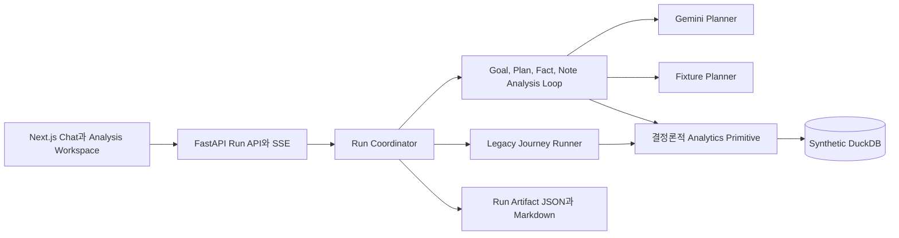

# Signal Trace — Customer Signal Analysis Demo

한국어 질문으로 합성 고객 신호를 분석하고, 대화에서 Goal, Plan, 공개 Fact,
Analysis Note, 최종 문서까지 한 Run으로 확인하는 로컬 워킹 데모입니다. 기존 고객
Journey 질문과 마스킹 Evidence 탐색도 같은 화면에서 계속 지원합니다.

> 이 프로젝트는 `seed=20260819`로 만든 합성 고객 30명만 사용합니다. 실제 고객
> 데이터, 운영 Connector, CRM 쓰기 기능은 포함하지 않으며 운영 용도로 사용할 수
> 없습니다.

## 검증 가능한 데모 계약

Fixture 모드는 다음 질문과 결과를 결정론적으로 재현합니다.

| 질문 | 대표 Primitive | 검증 결과 |
| --- | --- | ---: |
| `최근 부정 피드백이 많은 Topic과 관련 고객 Segment를 알려줘.` | `aggregate_events` | `6명` |
| `반복 행동 뒤 상담으로 전환되는 Journey를 보여줘.` | `match_sequence` | `6명` |
| `가입 시작 뒤 완료하지 못한 고객과 이탈 단계를 알려줘.` | `match_sequence`, `segment_customers` | `5명` |

오른쪽 Analysis Workspace에는 실행 중에도 공개 가능한 Step, Metric의 값과 단위,
Source, 스캔, 매칭, 반환 건수, Result ID, Evidence ID가 표시됩니다. 각 Step이 끝나면
검증된 Fact만 참조하는 Analysis Note가 추가됩니다. 내부 추론이나 Provider 원문은
표시하지 않습니다.

완료된 Run은 왼쪽 History에서 다시 열 수 있습니다. 새로고침 뒤에도 Goal, Plan,
Fact, Note, 보고서를 복원하며 JSON과 Markdown 파일을 내려받을 수 있습니다.

### 기존 Journey 호환 계약

- 질문: `AI 검색 실패 후 고객센터까지 문의한 고객이 얼마나 돼?`
- 패턴: 검색 실패 → 24시간 안에 같은 Topic 재검색 → 첫 실패 후 72시간 안에 VOC
- 전체 Source 결과: 정확히 `6명`
- VOC를 끈 결과: 완전한 패턴 `0명`과 Source 제한 안내
- 상세 탐색: 고객 Journey와 마스킹 Evidence

### 기본 분석 범위

- 시작: `2026-07-20T00:00:00+09:00` 이상
- 종료: `2026-08-19T00:00:00+09:00` 미만

종료일은 미포함(exclusive)입니다. UI의 기본 종료일 `2026-08-19`는
`2026-08-18` 하루 전체까지 포함합니다.

## 구조



수치와 고객 매칭은 DuckDB를 읽는 Analytics Primitive가 계산합니다. Gemini와
Fixture Planner는 분석 목표와 실행 순서를 선택합니다. 서버는 모델 서술을
공개하기 전에 같은 Run의 Fact와 Claim을 다시 검증합니다.

## 준비 사항

- Python `3.12`
- [uv](https://docs.astral.sh/uv/)
- Node.js `20.18.1` 이상과 npm
- GNU Make 또는 macOS Make

최초 한 번 다음 명령을 실행합니다. Python, Node 의존성과 Playwright Chromium을
설치합니다.

```bash
make setup
```

## 빠른 시작

키 없이 Fixture 데모를 실행할 수 있습니다.

```bash
make seed
make dev-fixture
```

브라우저에서 [http://127.0.0.1:3000](http://127.0.0.1:3000)을 엽니다.
`make dev-fixture`는 Backend와 Frontend를 함께 시작합니다. `Ctrl-C`, `INT`,
`TERM`을 받으면 스크립트가 자신이 시작한 두 프로세스만 종료합니다.

팀원에게 기능, 합성 데이터 생성 방식, 에이전트 역할을 설명하며 시연할 때는
[팀 데모 가이드](docs/team-demo-guide.md)를 사용합니다.

## 환경 파일 선택

`scripts/dev.sh`와 E2E Backend target은 다음 순서로 환경 파일 경로를 선택합니다.

1. 명시한 `ENV_FILE`
2. 현재 checkout 루트의 `.env`
3. `git rev-parse --git-common-dir`이 가리키는 디렉터리의 부모 checkout에 있는
   `.env`

세 위치에 파일이 없어도 Fixture 모드는 실행됩니다. 선택한 파일은 복사하거나
shell에 `source`하지 않습니다. `uv run --env-file`로 Backend Python 프로세스가
시작되기 전에 값을 전달하므로 LangSmith가 tracing 설정을 import 시점에 읽습니다.
선택한 환경 파일의 LangSmith 설정은 기존 shell의 `LANGSMITH_*`, `LANGCHAIN_*`
설정보다 우선합니다. Frontend 프로세스에는 Gemini나 LangSmith 값을 전달하지
않습니다.

명시적 파일을 사용하려면 절대 경로나 현재 checkout 기준 상대 경로를 지정합니다.

```bash
ENV_FILE=/absolute/path/to/demo.env make dev-gemini
```

현재 checkout용 `.env`를 새로 만들 때만 `backend/.env.example`을 참고합니다. 기존
`.env`는 덮어쓰면 안 됩니다.

```dotenv
AGENT_MODE=auto
GEMINI_API_KEY=your_key_here
GEMINI_MODEL=gemini-3.7-flash
GEMINI_FALLBACK_MODEL=gemini-3.6-flash
```

## Agent 모드

| 실행 | 동작 |
| --- | --- |
| `make dev` | 키가 있으면 Gemini를 사용하고 Provider 또는 검증 실패 시 공개 전환 이벤트를 남긴 뒤 Fixture로 전환하는 `auto` 모드 |
| `make dev-fixture` | API 키와 외부 네트워크가 필요 없는 결정론적 Fixture 모드 |
| `make dev-gemini` | 키 누락과 Provider 실패를 명시적 Run 오류로 표시하는 Gemini 전용 모드 |

Gemini 기본 모델은 `gemini-3.7-flash`입니다. 기본 모델이 Tool 호출 전에
`NOT_FOUND`를 반환할 때만 대체 모델 `gemini-3.6-flash`를 시도합니다.

## 명령

| 명령 | 설명 |
| --- | --- |
| `make setup` | `uv sync`, `npm ci`, Playwright Chromium 설치 |
| `make seed` | `seed=20260819` 데이터로 DuckDB 원자적 재생성 |
| `make dev` | Auto Backend `8000`, Frontend `3000` 실행 |
| `make dev-fixture` | Fixture Backend `8000`, Frontend `3000` 실행 |
| `make dev-gemini` | Gemini Backend `8000`, Frontend `3000` 실행 |
| `make test` | Backend pytest와 Ruff, Frontend Vitest와 typecheck, production build |
| `make e2e` | 전체 Fixture Desktop/Mobile 브라우저 E2E |
| `make e2e-generic` | 세 범용 질문, History, 다운로드, clarification, mobile 계약 E2E |
| `make e2e-legacy` | 기존 Journey와 Evidence 회귀 E2E |

## E2E 격리

Playwright는 기본적으로 Frontend `33100`, Backend `38100`에서 새 서버를
시작합니다. Artifact는 `frontend/node_modules/.cache/run-artifacts-38100`에 저장해
개발용 기록과 분리합니다. 다음 변수로 경로와 포트를 바꿀 수 있습니다.

- `E2E_FRONTEND_PORT`
- `E2E_BACKEND_PORT`
- `E2E_ARTIFACT_DIRECTORY`

Fixture E2E는 `AGENT_MODE=fixture`를 Uvicorn 프로세스에 강제하므로 API 키와 외부
호출이 필요하지 않습니다. 같은 포트가 이미 사용 중이면 기존 프로세스를 종료하지
않고 실패합니다. 자신이 직접 시작한 fixture 서버를 재사용할 때만 다음 명령을
사용합니다.

```bash
PLAYWRIGHT_REUSE_SERVER=1 make e2e
```

실제 Gemini 동적 Planner는 `.env`를 읽은 서버를 먼저 실행한 뒤 별도 터미널에서
명시적으로 smoke를 실행합니다.

```bash
BACKEND_PORT=38100 FRONTEND_PORT=33100 make dev-gemini

RUN_LIVE_GEMINI=1 PLAYWRIGHT_REUSE_SERVER=1 \
  E2E_BACKEND_PORT=38100 E2E_FRONTEND_PORT=33100 \
  npm --prefix frontend run e2e -- \
  live-gemini-planner.spec.ts --project desktop-chromium
```

`RUN_LIVE_GEMINI`를 지정하지 않으면 이 smoke는 skip합니다. API Key와 LangSmith
설정은 Backend 프로세스에만 전달합니다.

## 포트와 Endpoint

| 주소 | 용도 |
| --- | --- |
| `http://127.0.0.1:3000` | Next.js UI |
| `http://127.0.0.1:8000/health` | Backend 상태 |
| `http://127.0.0.1:8000/api/sources` | 공개 Source catalog |
| `http://127.0.0.1:8000/api/runs` | Run 생성 |
| `http://127.0.0.1:8000/api/runs/{run_id}` | Run snapshot |
| `http://127.0.0.1:8000/api/runs/{run_id}/events` | `Last-Event-ID` 재연결을 지원하는 SSE |
| `http://127.0.0.1:8000/api/runs/{run_id}/clarification` | 같은 Run의 확인 답변 제출 |
| `http://127.0.0.1:8000/api/run-artifacts` | 최근 Run History |
| `http://127.0.0.1:8000/api/run-artifacts/{run_id}/document` | 저장 문서 View JSON |
| `http://127.0.0.1:8000/api/run-artifacts/{run_id}/download.json` | Run Artifact 다운로드 |
| `http://127.0.0.1:8000/api/run-artifacts/{run_id}/download.md` | Markdown 문서 다운로드 |
| `http://127.0.0.1:8000/mcp/` | Gemini용 read-only MCP HTTP endpoint |

Frontend API 주소는 `NEXT_PUBLIC_API_BASE_URL`로 바꿀 수 있으며 기본값은
`http://127.0.0.1:8000`입니다. Backend origin을 바꾸면 `FRONTEND_ORIGIN`도 실제
Frontend origin과 맞아야 합니다.

## Gemini 실호출 기록

[Gemini 실호출 검증 문서](docs/verification/live-gemini-smoke.md)는 현재 실행 결과가
아닌 기록 템플릿입니다. 실제 승인된 호출을 수행한 뒤에만 Run ID, 모델, 시간,
관측값을 작성해야 합니다. 이 작업의 Fixture E2E는 Gemini를 호출하지 않습니다.

## 문제 해결

- `Address already in use`: 지정 포트에 이미 서버가 있습니다. E2E는 해당
  프로세스를 종료하지 않으므로 다른 `E2E_BACKEND_PORT`, `E2E_FRONTEND_PORT`를
  지정해야 합니다.
- `ENV_FILE이 존재하지 않습니다`: `ENV_FILE` 경로를 수정하거나 변수를 제거해 자동
  탐색을 사용합니다.
- `Python 3.12`를 찾지 못함: Python 3.12를 설치하고 `make setup`을 다시 실행합니다.
- Playwright가 브라우저를 찾지 못함: `npm --prefix frontend run e2e:install`을
  실행합니다.
- 화면에 서버 연결 오류가 남음: Backend `/health`, `NEXT_PUBLIC_API_BASE_URL`,
  `FRONTEND_ORIGIN` 순서로 확인합니다.
- Gemini 키가 없거나 호출이 실패함: `make dev-fixture`로 전체 데모를 검증합니다.
- 데이터가 예상과 다름: `make seed`로 고정 Seed DuckDB를 다시 만듭니다.

Evidence API는 현재 Run이 허용한 ID만 반환하고 고객 식별자는 마스킹합니다. Run
Artifact는 로컬 파일이며 운영 저장소가 아닙니다.
