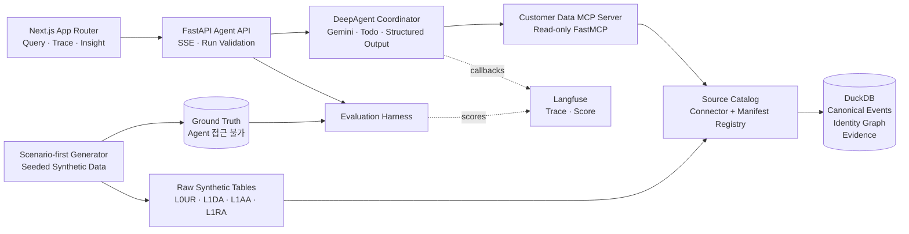
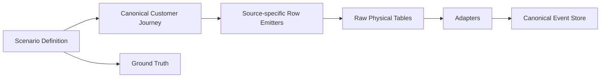
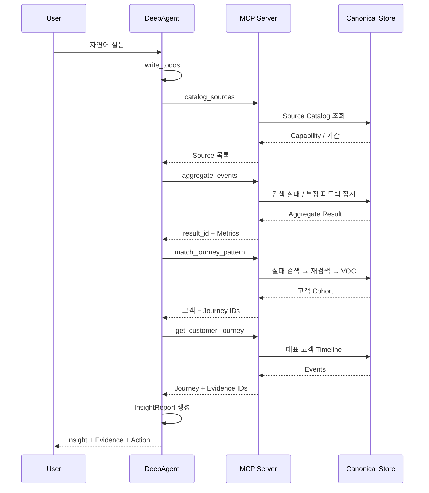

## 결론

현재 spec의 `Question → Explore → Connect → Reason → Insight → Action` 흐름과 `Chat / Insight Dashboard / Customer Journey` 화면 구조는 유지하는 게 맞다. 다만 기존의 `Prompt + Mock JSON + LLM API` 방식은 **실제 데이터를 탐색한 것처럼 보이는 데모**에 가깝다. 이번 구현에서는 데이터 접근을 MCP Tool로 분리해 **실제로 계획을 세우고 조회하고 근거를 수집하는 Agent**로 바꾸는 것이 핵심이다.

DeepAgents는 멀티에이전트 플랫폼으로 사용하지 않는다. 다음 네 기능만 사용하는 얇은 하네스로 두는 게 적절하다.

- MCP Tool 호출
- `TodoListMiddleware`를 이용한 작업 계획 표시
- Pydantic 기반 구조화 응답
- Tool 실행 이벤트 스트리밍

DeepAgents는 LangGraph 런타임 위에서 Tool 실행, 계획, 컨텍스트 관리, 서브에이전트, 스트리밍을 제공한다. 하지만 계획 기능은 선택 사항이고, 서브에이전트는 컨텍스트가 커지거나 전문 역할 분리가 필요한 경우에 적합하다. 이번 10~30명 규모 합성 데이터 MVP에서는 기본 서브에이전트와 파일 쓰기·코드 실행 기능을 끄는 편이 낫다. ([Docs by LangChain][1])

---

# 1. 전체 아키텍처



경계는 다음처럼 잡는다.

| 계층         | 책임                                               | 포함하지 않는 것                 |
| ------------ | -------------------------------------------------- | -------------------------------- |
| DeepAgent    | 질문 해석, 계획, Tool 선택, 최종 설명              | SQL, 테이블 조인, 위험 점수 계산 |
| MCP Server   | 조회, 집계, Journey 생성, 신호 점수, Evidence 반환 | 자연어 응답 생성                 |
| Adapter/Data | 원본 읽기, 컬럼 매핑, ID 연결, 정규화              | 질문 해석                        |
| UI           | 계획·Tool 실행·결과·근거 렌더링                    | 분석 로직                        |
| Eval         | 합성 데이터 정답과 Agent 결과 비교                 | Agent 실행 제어                  |

가장 중요한 원칙은 다음이다.

> **LLM은 무엇을 확인할지 결정하고, 데이터 계층은 사실을 계산한다.**

Risk Score, 고객 수, 비율, Journey 매칭 여부를 LLM이 계산하게 두면 안 된다.

---

# 2. Adapter는 두 축으로 분리한다

“어떤 형태의 데이터가 들어올지 모른다”는 문제를 하나의 `DataSourceAdapter`로 해결하려 하면 곧 소스별 코드가 늘어난다.

다음처럼 분리해야 한다.

```text
SourceConnector
    원본을 어떻게 읽는가
    CSV / Parquet / DuckDB / PostgreSQL / BigQuery / HTTP

SchemaManifest
    각 컬럼이 무엇을 의미하는가
    timestamp / identity / action / outcome / text / attributes

IdentityResolver
    RUN_ID / SESSION_ID / CUST_NO / ENTR_NO 등을
    canonical_customer_id로 어떻게 연결하는가

CanonicalStore
    Agent Tool이 조회하는 공통 Event 공간
```

새 테이블이 기존과 유사한 정형 테이블이면 코드 추가 없이 Manifest만 등록한다.

새 저장소가 추가될 때만 Connector를 구현한다.

---

## 2.1 Canonical Event Contract

원본 테이블 구조가 바뀌어도 Agent와 MCP가 의존하는 모델은 고정한다.

```python
from __future__ import annotations

from datetime import datetime
from enum import StrEnum
from typing import Any, AsyncIterator, Protocol

from pydantic import BaseModel, Field


Scalar = str | int | float | bool | None


class EventType(StrEnum):
    SEARCH = "search"
    FEEDBACK = "feedback"
    DIGITAL_BEHAVIOR = "digital_behavior"
    SUBSCRIPTION = "subscription"
    VOC = "voc"


class IdentityRef(BaseModel):
    namespace: str
    value: str


class CustomerEvent(BaseModel):
    event_id: str
    evidence_id: str

    source_id: str
    occurred_at: datetime
    event_type: EventType

    action: str
    topic: str | None = None
    outcome: str | None = None
    text: str | None = None

    identities: list[IdentityRef]
    canonical_customer_id: str | None = None

    attributes: dict[str, Scalar] = Field(default_factory=dict)


class SourceDescriptor(BaseModel):
    source_id: str
    display_name: str
    description: str

    capabilities: set[str]
    identity_namespaces: set[str]

    min_occurred_at: datetime | None = None
    max_occurred_at: datetime | None = None
    estimated_rows: int | None = None


class SourceQuery(BaseModel):
    start_at: datetime | None = None
    end_at: datetime | None = None
    customer_ids: list[str] = Field(default_factory=list)
    event_types: list[EventType] = Field(default_factory=list)
    topics: list[str] = Field(default_factory=list)
    limit: int = Field(default=100, ge=1, le=500)


class SourceConnector(Protocol):
    async def scan(
        self,
        query: SourceQuery,
    ) -> AsyncIterator[dict[str, Any]]:
        ...


class EventMapper(Protocol):
    def map_record(
        self,
        record: dict[str, Any],
    ) -> CustomerEvent | None:
        ...
```

Canonical 모델에 반드시 필요한 것은 다음 정도다.

- 이벤트 시간
- Source
- 이벤트 종류
- 행동
- 결과 또는 상태
- 주제 또는 텍스트
- 연결 가능한 식별자
- 원본 근거를 찾을 `evidence_id`

모든 Source가 모든 필드를 제공할 필요는 없다. 대신 `SourceDescriptor.capabilities`로 가능한 분석을 명시한다.

---

## 2.2 Manifest 예시

첨부된 컬럼명은 일부가 잘려 있으므로 아래는 확정 스키마가 아니라 매핑 구조 예시다.

```yaml
source_id: l0ur_search_history
display_name: 사용자 검색 이력
reader:
  type: parquet
  path: data/raw/L0UR_SEARCH_HISTORY.parquet

identity:
  - namespace: search_run
    column: RUN_ID
  - namespace: search_thread
    column: THREAD_ID

event:
  occurred_at:
    column: CREATED_AT
    cast: datetime

  event_type:
    const: search

  action:
    const: query

  topic:
    column: SEARCH_QUERY

  text:
    column: SEARCH_QUERY

  outcome:
    column: STATUS

  attributes:
    search_result:
      column: SEARCH_RESULT
    first_response_seconds:
      column: FIRST_RESPONSE
    cache_hit:
      column: WAS_CACHE_HIT
```

피드백 Source는 같은 `RUN_ID`를 `search_run` namespace로 등록하면 검색 이력과 연결할 수 있다.

```yaml
source_id: l0ur_feedback
display_name: 검색 Agent 사용자 피드백

identity:
  - namespace: search_run
    column: RUN_ID

event:
  occurred_at:
    column: BQ_LOAD_DTTM
    cast: datetime

  event_type:
    const: feedback

  action:
    const: user_feedback

  outcome:
    column: FEEDBACK_TYPE

  text:
    column: REASON

  attributes:
    option:
      column: OPTION
```

---

# 3. 가장 큰 위험은 Schema가 아니라 Identity다

첨부 스키마상 다음 연결은 비교적 명확하다.

| 연결                    | 후보 키                                         |
| ----------------------- | ----------------------------------------------- |
| 검색 이력 ↔ 검색 피드백 | `RUN_ID`                                        |
| GA 세션 내부 이벤트     | `CLT_ID`, `SESN_ID`                             |
| GA ↔ 가입 정보          | `CUST_NO`, `ENTR_NO` 후보                       |
| 가입 정보 ↔ VOC         | `CUST_NO`, `ENTR_NO` 또는 별도 고객 식별키 후보 |

반면 검색 이력의 `THREAD_ID`, `RUN_ID`를 GA나 고객번호까지 연결하는 경로는 현재 자료만으로 확정할 수 없다.

첨부된 `CSZ 연결키`, `GA 연결키`가 실제 Cross-source Join Key인지도 데이터 사전 확인이 필요하다. 이름만 보고 연결하면 안 된다.

따라서 합성 데이터에는 별도의 Identity Graph를 만들어야 한다.

```text
search_run:R-102
    ↓ exact
search_thread:T-10
    ↓ synthetic bridge
digital_session:S-301
    ↓ exact
customer:CUST-007
    ↓ exact
subscription:ENTR-502
```

저장 구조는 다음 정도면 충분하다.

```text
identity_edges
────────────────────────────────────────
left_namespace
left_value
right_namespace
right_value
link_type          EXACT | DECLARED | SYNTHETIC
confidence
source_id
valid_from
valid_to
```

MVP에서는 `EXACT`, `DECLARED`, `SYNTHETIC`만 사용한다.

시간·문구 유사도를 이용한 추정 조인은 넣지 않는다.

> Identity 연결이 없으면 Adapter나 Agent Framework를 아무리 잘 만들어도 Cross-channel Journey는 만들 수 없다.

---

# 4. 합성 데이터는 Row-first가 아니라 Scenario-first로 만든다

단순히 각 테이블에 랜덤 Row를 넣으면 질문에 대한 정답과 고객 Journey가 생기지 않는다.

다음 순서로 생성해야 한다.



즉, 먼저 고객에게 실제로 어떤 일이 일어났는지를 만든다.

그 후 같은 Journey를 각 테이블 구조로 흩어 놓는다.

이 방식은 Adapter를 통과시킨 결과가 원래 Journey와 같은지 검증하는 Round-trip Test까지 가능하게 한다.

---

## 4.1 제안 Dataset

30명의 고객, 최근 30일, 약 1,000~1,500개 이벤트면 충분하다.

| Scenario                   | Positive Pattern                                                                | 의도적인 오탐 후보                           |
| -------------------------- | ------------------------------------------------------------------------------- | -------------------------------------------- |
| 인터넷 품질 기반 해지 위험 | 장애 검색 → 부정 피드백 → 장애 페이지 반복 방문 → 미해결 VOC → 위약금/해지 검색 | 장애가 즉시 해결된 고객, 단순 요금 비교 고객 |
| AI 검색 실패 후 상담 전환  | 검색 실패 → 동일 주제 재검색 → 72시간 이내 VOC                                  | 검색은 실패했지만 다른 경로에서 해결된 고객  |
| 로밍 가입 Funnel 이탈      | 로밍 메뉴 → 인증 반복 → 가입 완료 이벤트 없음 → 관련 VOC                        | 정보 탐색만 하고 가입 의도가 없던 고객       |
| 반복 Pain Point            | 같은 Topic의 검색·피드백·VOC가 여러 고객에서 반복                               | 이벤트 수는 많지만 정상 처리된 Topic         |

각 Scenario에는 다음을 둔다.

```yaml
scenario_id: internet_churn_quality_v1
seed: 260819

population:
  total_customers: 30
  positive_customers: 6
  ambiguous_customers: 4

ground_truth:
  expected_customer_ids:
    - CUST-003
    - CUST-009
    - CUST-014

  required_signals:
    - repeated_failure_search
    - negative_feedback
    - unresolved_voc
    - cancellation_intent

noise:
  duplicate_rate: 0.02
  missing_optional_field_rate: 0.05
  unrelated_event_ratio: 0.25
```

Ground Truth는 MCP Server가 접근하지 못하는 별도 경로에 둔다.

---

# 5. MCP Tool은 Raw Table Tool이 아니라 분석 Tool이어야 한다

FastMCP로 Streamable HTTP MCP 서버를 만들고, DeepAgent에서는 `langchain-mcp-adapters`로 Tool을 가져온다. `MultiServerMCPClient`는 기본적으로 Tool 호출마다 새로운 MCP 세션을 만드는 Stateless 방식이므로, Tool이 이전 호출의 서버 세션 상태에 의존하지 않게 설계하는 편이 맞다. 모든 분석 범위와 조건은 인자로 전달한다. ([Docs by LangChain][2])

추천 Tool은 6개다.

| Tool                    | 목적                                     | 주요 출력                           |
| ----------------------- | ---------------------------------------- | ----------------------------------- |
| `catalog_sources`       | 사용 가능한 Source와 분석 가능 범위 확인 | Source, 기간, capability, row count |
| `aggregate_events`      | Topic·채널·기간별 집계                   | 고객 수, 이벤트 수, 비율, result ID |
| `rank_customers`        | 정의된 Signal Policy로 고객 순위 계산    | 고객, 점수, Signal, Evidence        |
| `match_journey_pattern` | 이벤트 순서를 기준으로 Journey 검색      | 매칭 고객, 단계별 이벤트            |
| `get_customer_journey`  | 특정 고객의 통합 Timeline 조회           | 시간순 Event                        |
| `get_evidence`          | 최종 근거 Row 확인                       | 마스킹된 원본 필드                  |

다음 Tool은 만들지 않는다.

```text
execute_sql(sql: str)
query_table(table_name: str, where: str)
load_all_rows(table_name: str)
```

자유 SQL은 Tool Call 오류, 무제한 조회, 프롬프트 인젝션, 문맥 폭증을 동시에 만든다.

---

## 5.1 Tool 응답 Envelope

모든 Tool 응답 형식을 통일한다.

```python
from typing import Generic, Literal, TypeVar

from pydantic import BaseModel, Field


T = TypeVar("T")


class ToolStats(BaseModel):
    duration_ms: int
    scanned_rows: int
    returned_rows: int


class ToolResult(BaseModel, Generic[T]):
    status: Literal["ok", "partial", "empty", "error"]
    result_id: str
    summary: str

    data: T | None = None
    evidence_ids: list[str] = Field(default_factory=list)

    stats: ToolStats
    warnings: list[str] = Field(default_factory=list)
```

`result_id`는 집계 결과의 근거다.

```text
agg:7e12d9
journey:bd218a
row:l0ur_search_history:000219
row:l1ra_voc_stt:000038
```

최종 응답은 이 ID만 참조한다.

---

## 5.2 Tool 실행 제한

MCP Server에서 강제한다.

| 제한                 |         권장값 |
| -------------------- | -------------: |
| Tool 호출            | Run당 최대 8회 |
| 일반 Query 반환      |     최대 100행 |
| Journey 고객         |      최대 10명 |
| 고객별 Journey Event |      최대 50개 |
| Evidence 조회        |      최대 20개 |
| Query Timeout        |            5초 |
| 전체 Agent Timeout   |           60초 |

제한을 Agent Prompt에만 적지 말고 Server에서 검증해야 한다.

---

# 6. DeepAgent 구성

## 6.1 초기 버전은 Single Coordinator

DeepAgents는 기본적으로 범용 서브에이전트를 추가할 수 있지만 이번 범위에서는 끈다.

30명 규모 데이터에서 Tool 결과를 제한하면 Context 격리 필요성이 낮다. 서브에이전트는 LLM 호출 수, latency, Tool 선택 실패 지점을 늘린다. DeepAgents 공식 문서도 단순 작업이나 오버헤드가 더 큰 경우에는 서브에이전트를 사용하지 말 것을 제시한다. ([Docs by LangChain][3])

구성은 다음과 같다.

```python
from deepagents import (
    GeneralPurposeSubagentProfile,
    HarnessProfile,
    create_deep_agent,
    register_harness_profile,
)
from langchain.agents.middleware import TodoListMiddleware
from langchain_google_genai import ChatGoogleGenerativeAI
from langchain_mcp_adapters.client import MultiServerMCPClient


register_harness_profile(
    "google_genai",
    HarnessProfile(
        excluded_tools=frozenset(
            {
                "ls",
                "read_file",
                "write_file",
                "edit_file",
                "delete",
                "glob",
                "grep",
                "execute",
            }
        ),
        general_purpose_subagent=GeneralPurposeSubagentProfile(
            enabled=False,
        ),
    ),
)


async def build_customer_intelligence_agent(
    mcp_client: MultiServerMCPClient,
    model_name: str,
):
    tools = await mcp_client.get_tools()

    model = ChatGoogleGenerativeAI(
        model=model_name,
        temperature=1.0,
        timeout=60,
        max_retries=2,
    )

    return create_deep_agent(
        name="customer-intelligence-agent",
        model=model,
        tools=tools,
        middleware=[TodoListMiddleware()],
        system_prompt=SYSTEM_PROMPT,
        response_format=InsightReport,
    )
```

MCP Client와 Agent는 요청마다 생성하지 않고 FastAPI lifespan에서 한 번 초기화한다.

Gemini 모델명은 코드에 고정하지 않고 `GEMINI_MODEL` 환경변수로 둔다. 해커톤에서는 API Key 방식을 쓰고, 이후 Vertex AI로 전환할 때 같은 `ChatGoogleGenerativeAI` 통합을 유지한다. 현재 LangChain의 Google 통합은 Gemini Developer API와 Vertex AI를 모두 지원하며, Gemini Structured Output에는 native JSON Schema 방식이 권장된다. Gemini 3 계열은 임의로 낮은 temperature를 강제하기보다 권장 기본값을 유지하고, 재현성은 Tool과 Output Schema로 확보하는 편이 낫다. ([Docs by LangChain][4])

DeepAgents는 `response_format`으로 Pydantic 구조를 검증한 결과를 `structured_response`에 반환한다. ([Docs by LangChain][5])

---

## 6.2 Agent System Policy

```text
역할
- 여러 고객 데이터 Source를 탐색하는 읽기 전용 Customer Intelligence Analyst다.

실행 규칙
1. 복수 Source 분석이면 먼저 3~6개의 Todo를 작성한다.
2. 전체 Raw Row를 요청하지 않는다.
3. Aggregate → Candidate Cohort → Journey → Evidence 순서로 좁힌다.
4. 고객 식별자를 직접 추정해 연결하지 않는다.
5. Risk Score와 집계 값은 Tool 결과만 사용한다.
6. 모든 Finding과 Recommendation에는 Evidence ID를 포함한다.
7. 반환받지 않은 고객 ID, 수치, Evidence ID를 생성하지 않는다.
8. 데이터가 부족하면 결론을 만들지 말고 limitation으로 기록한다.
9. Tool 호출은 최대 8회로 제한한다.
10. 최종 출력은 InsightReport Schema를 따른다.
```

---

# 7. 최종 응답 Contract

```python
from typing import Literal

from pydantic import BaseModel, Field


class AnalysisScope(BaseModel):
    start_date: str
    end_date: str
    enabled_sources: list[str]
    population_description: str


class Metric(BaseModel):
    label: str
    value: float | int | str
    unit: str | None = None
    result_id: str


class Finding(BaseModel):
    title: str
    description: str
    confidence: Literal["high", "medium", "low"]
    evidence_ids: list[str]


class RankedCustomer(BaseModel):
    customer_id: str
    score: float
    risk_level: Literal["high", "medium", "low"]
    signals: list[str]
    evidence_ids: list[str]


class Recommendation(BaseModel):
    action_id: Literal[
        "care_call",
        "network_diagnosis",
        "content_improvement",
        "funnel_improvement",
        "campaign_target",
        "further_analysis",
    ]
    title: str
    reason: str
    evidence_ids: list[str]


class InsightReport(BaseModel):
    analysis_type: Literal[
        "cohort",
        "journey",
        "funnel",
        "pain_point",
        "general",
    ]

    scope: AnalysisScope
    headline: str
    executive_summary: str

    metrics: list[Metric] = Field(default_factory=list)
    findings: list[Finding] = Field(default_factory=list)
    ranked_customers: list[RankedCustomer] = Field(default_factory=list)

    representative_journey_ids: list[str] = Field(default_factory=list)
    recommendations: list[Recommendation] = Field(default_factory=list)

    sources_used: list[str] = Field(default_factory=list)
    limitations: list[str] = Field(default_factory=list)
```

---

## 7.1 Schema 검증만으로는 부족하다

Pydantic은 JSON 구조만 검증한다.

API 계층에서 추가로 다음을 검증한다.

```text
Evidence ID가 이번 Run의 Tool 결과에 존재하는가
Customer ID가 Tool 결과에 포함되었는가
Metric 값이 result_id의 실제 값과 같은가
사용하지 않은 Source를 sources_used에 넣지 않았는가
Risk Score가 MCP에서 계산된 값과 같은가
Recommendation에 최소 하나의 Evidence가 있는가
```

검증 실패 시 한 번만 수정 요청을 보낸다.

두 번째에도 실패하면 결과를 `degraded`로 표시하고, 검증된 Metric과 Journey만 렌더링한다.

---

# 8. 질문 실행 흐름

예를 들어 다음 질문을 받는다.

> AI검색에서 해결하지 못하고 고객센터까지 문의한 고객이 얼마나 돼?

Agent가 생성할 계획은 이 정도면 된다.

```text
1. 분석 가능한 검색·피드백·VOC Source와 기간 확인
2. 실패 검색과 부정 피드백 고객 집계
3. 동일 Topic 재검색 후 72시간 이내 VOC Journey 탐색
4. 주요 문의 Topic 집계
5. 대표 고객 Journey와 Evidence 확인
6. Insight와 Action 생성
```

Tool 호출은 다음처럼 된다.



---

# 9. Trace는 두 층으로 구성한다

## 9.1 사용자에게 보여주는 Trace

DeepAgents 내부 이벤트를 그대로 Frontend에 노출하지 않는다.

FastAPI에서 다음 SSE Contract로 변환한다.

```text
run.started
plan.updated
tool.started
tool.completed
tool.failed
report.validating
report.completed
run.failed
```

예시:

```json
{
  "type": "tool.completed",
  "run_id": "run-0182",
  "tool": "match_journey_pattern",
  "label": "검색 실패 후 VOC 전환 Journey 탐색",
  "duration_ms": 318,
  "matched_customers": 7,
  "evidence_count": 24
}
```

화면에는 모델의 내부 추론 문장을 보여주지 않는다.

보여줄 것은 다음뿐이다.

- Agent 계획
- 호출한 Tool
- 조회한 Source
- 반환 건수
- 소요 시간
- 발견한 Evidence

DeepAgents는 coordinator와 subagent message, Tool call, output을 스트리밍하는 API를 제공한다. 현재 Event Streaming은 Beta이므로, Frontend가 DeepAgents 이벤트 구조에 직접 의존하지 않게 `AgentEventTranslator`를 둬야 한다. ([Docs by LangChain][6])

---

## 9.2 개발자용 Langfuse Trace

Langfuse에는 다음을 남긴다.

```text
run_id
question
model
dataset_version
manifest_version
prompt_version
signal_policy_version
enabled_sources
tool sequence
tool latency
input/output token
validation result
evaluation score
```

Python에서는 Langfuse의 LangChain `CallbackHandler`를 Agent 실행 config에 전달하면 된다. 최신 통합에서는 `from langfuse.langchain import CallbackHandler`를 사용한다. ([Langfuse][7])

```python
from langfuse.langchain import CallbackHandler


handler = CallbackHandler()

result = await agent.ainvoke(
    {
        "messages": [
            {
                "role": "user",
                "content": question,
            }
        ]
    },
    config={
        "callbacks": [handler],
        "run_name": "customer-intelligence.query",
        "metadata": {
            "langfuse_session_id": run_id,
            "langfuse_tags": [
                dataset_version,
                prompt_version,
            ],
        },
    },
)
```

로컬 Langfuse는 Docker Compose가 가장 단순한 설치 방식이며 기본 UI는 로컬 3000 포트에서 접근한다. 다만 Compose 구성은 HA나 수평 확장 목적이 아니므로 해커톤·개발 환경에서만 사용한다. ([Langfuse][8])

실제 고객 데이터로 확장할 때는 다음 필드를 Langfuse에 보내지 않는다.

- 원본 고객번호
- 가입번호
- 전체 VOC/STT 문장
- 전화번호·주소
- Raw Search Result

Trace에는 마스킹된 ID와 Evidence ID만 기록한다.

---

# 10. Frontend 구조

기존 spec의 3개 화면 영역을 한 화면에서 연결한다.

```text
┌─────────────────────────────────────────────────────────────────┐
│ Question Input · 추천 질문 · 기간 · Source Toggle               │
├──────────────────────┬──────────────────────────────────────────┤
│ Agent Trace          │ Insight                                  │
│                      │                                          │
│ ✓ Source 확인        │ 해지 위험 고객 7명                       │
│ ✓ 실패 검색 집계     │ 주요 Signal                              │
│ ✓ Journey 탐색       │ Signal Contribution                     │
│ ● Evidence 확인      │ Ranked Customer Table                   │
│                      │                                          │
├──────────────────────┴──────────────────────────────────────────┤
│ Customer Journey Timeline                                       │
│ Search → Feedback → GA → VOC → Churn Intent                     │
├─────────────────────────────────────────────────────────────────┤
│ Evidence Drawer                                                  │
└─────────────────────────────────────────────────────────────────┘
```

Next.js App Router 기준 컴포넌트는 다음 정도면 충분하다.

```text
app/
  page.tsx
  runs/[runId]/page.tsx

components/
  query/
    QueryComposer.tsx
    SuggestedQuestions.tsx
    SourceScopeSelector.tsx

  trace/
    AgentPlan.tsx
    ToolExecutionList.tsx

  insight/
    MetricCards.tsx
    Findings.tsx
    RankedCustomerTable.tsx
    SignalContribution.tsx
    Recommendations.tsx

  journey/
    JourneyTimeline.tsx
    EvidenceDrawer.tsx
```

---

# 11. 비용 대비 효과가 높은 Wow Point

## 11.1 Source Ablation

화면 상단에서 Source를 끄고 다시 분석한다.

```text
전체 Source
Search + Feedback + GA + Subscription + VOC

VOC 제외
Search + Feedback + GA + Subscription

Search만
Search History
```

결과를 나란히 보여준다.

```text
전체 Source: 위험 고객 7명 / Recall 100%
VOC 제외:    위험 고객 4명 / Recall 67%
Search만:    위험 고객 2명 / Recall 33%
```

이 기능은 “데이터를 연결했을 때만 발견되는 문제”라는 프로젝트 가치를 가장 직접적으로 보여준다.

구현 비용도 낮다. 모든 MCP Query에 `enabled_sources`만 전달하면 된다.

---

## 11.2 Evidence-first Insight

각 Finding을 클릭하면 근거 Row와 Journey가 열린다.

```text
Finding
"품질 문제를 반복적으로 시도했지만 해결되지 않은 고객입니다."

Evidence
row:l0ur_search_history:219
row:l0ur_feedback:44
row:l1da_ga_rep_chnl_behv:981
row:l1ra_voc_stt:38
```

단순한 AI 설명보다 신뢰도가 높다.

---

## 11.3 Golden Replay

4개의 추천 질문 옆에 `검증 실행`을 둔다.

Agent 결과를 Ground Truth와 비교한다.

```text
Cohort Precision@5       1.00
Cohort Recall            0.83
Evidence Coverage        0.92
Unsupported Claim Rate   0.00
Tool Calls               6
Latency                   8.4s
```

Langfuse는 Trace에 Score를 연결하는 기능을 제공하므로 이 결과를 Run에 기록할 수 있다. ([Langfuse][7])

이 기능은 심사위원용 화면이라기보다 “이 Agent가 우연히 답한 것이 아니다”라는 기술적 증거가 된다.

---

## 11.4 Subagent는 마지막 옵션

기본 기능이 완성된 뒤에만 다음 두 역할을 붙인다.

```text
cohort-analyst
- aggregate_events
- rank_customers

journey-analyst
- match_journey_pattern
- get_customer_journey
- get_evidence
```

Main Agent가 두 작업을 병렬 위임하고 결과를 합칠 수 있다.

다만 데모의 Wow Point는 Multi-agent 애니메이션보다 Source Ablation과 Evidence Provenance가 더 크다.

---

# 12. Repository 구조

```text
customer-intelligence-agent/
├─ apps/
│  └─ web/                         # Next.js App Router
│
├─ services/
│  ├─ api/                         # FastAPI + SSE
│  │  ├─ main.py
│  │  ├─ routes/
│  │  ├─ agent_runtime.py
│  │  └─ event_translator.py
│  │
│  └─ mcp/                         # FastMCP
│     ├─ server.py
│     ├─ tools/
│     │  ├─ catalog.py
│     │  ├─ aggregate.py
│     │  ├─ cohort.py
│     │  ├─ journey.py
│     │  └─ evidence.py
│     └─ policies/
│
├─ packages/
│  ├─ ci_domain/
│  │  ├─ events.py
│  │  ├─ identity.py
│  │  ├─ evidence.py
│  │  └─ insight.py
│  │
│  ├─ ci_data/
│  │  ├─ connectors/
│  │  │  ├─ parquet.py
│  │  │  ├─ duckdb.py
│  │  │  └─ sql.py
│  │  ├─ manifests.py
│  │  ├─ mapper.py
│  │  └─ registry.py
│  │
│  ├─ ci_generator/
│  │  ├─ scenarios/
│  │  ├─ emitters/
│  │  └─ generate.py
│  │
│  └─ ci_eval/
│     ├─ cases.py
│     ├─ metrics.py
│     └─ runner.py
│
├─ data/
│  ├─ manifests/
│  ├─ generated/
│  │  ├─ raw/
│  │  ├─ canonical.duckdb
│  │  └─ dataset.json
│  └─ ground_truth/
│
├─ prompts/
│  └─ customer_intelligence_v1.md
│
├─ docker-compose.yml
├─ pyproject.toml
└─ .env.example
```

12시간 해커톤에서는 Nx까지 도입하지 않는다. `pnpm`과 `uv` 조합이면 충분하다.

---

# 13. 12시간 구현 순서

| 시간        | 결과물                                       | 통과 기준                            |
| ----------- | -------------------------------------------- | ------------------------------------ |
| 0:00–1:00   | Canonical Event, Identity, Evidence Contract | 5개 Source를 공통 Event로 표현 가능  |
| 1:00–3:00   | 4개 Scenario Generator                       | 30명 데이터와 Ground Truth 생성      |
| 3:00–4:30   | Manifest Adapter + DuckDB                    | Raw Table이 Canonical Event로 변환   |
| 4:30–6:00   | FastMCP 6개 Tool                             | CLI에서 집계·Journey·Evidence 조회   |
| 6:00–7:30   | DeepAgent + Gemini                           | 추천 질문 1개가 구조화 응답으로 완료 |
| 7:30–10:00  | Next.js UI + SSE                             | 계획·Tool·Insight·Journey 렌더링     |
| 10:00–11:00 | Langfuse + Run Metadata                      | Agent와 Tool Trace 확인              |
| 11:00–11:40 | Source Ablation + Eval                       | Source 제외 시 결과 차이 표시        |
| 11:40–12:00 | Demo Dataset 고정·리허설                     | 4개 질문 반복 성공                   |

절대 Cut Line은 6시간 시점이다.

그때 CLI에서 다음이 동작해야 한다.

```text
질문
→ Tool 3~6회
→ 고객 Cohort
→ Journey
→ Evidence
→ InsightReport
```

이게 안 되면 Langfuse, Eval, Subagent를 모두 미룬다.

---

# 14. 주요 실패 지점

| 실패 지점                       | 영향                         | 대응                                        |
| ------------------------------- | ---------------------------- | ------------------------------------------- |
| Search와 고객 ID 연결 경로 없음 | Cross-channel Journey 불가   | Synthetic Identity Bridge를 명시적으로 생성 |
| Source별 의미가 불명확          | 잘못된 Event 정규화          | Manifest 등록 시 데이터 사전 필수           |
| Raw Data를 LLM에 대량 전달      | Token 증가, 품질 하락        | Aggregate와 Evidence Handle만 반환          |
| LLM이 수치 생성                 | 잘못된 고객 수·Risk Score    | MCP 계산 + semantic validator               |
| Tool 반복 호출                  | Latency, API 비용 증가       | Run당 8회 제한                              |
| DeepAgents 이벤트 API 변경      | Frontend 깨짐                | App 전용 SSE Contract로 변환                |
| Trace에 PII 저장                | 보안 문제                    | Trace Redactor + Evidence ID                |
| 합성 데이터가 너무 명확함       | Agent가 탐색하지 않아도 정답 | Decoy, Noise, Missing Event 추가            |
| Local Langfuse 설치 지연        | 핵심 기능 일정 영향          | 자체 Run Trace를 P0, Langfuse를 P1로 분리   |

---

# 최종 권고안

이번 MVP의 구현 중심은 DeepAgents가 아니다.

```text
Scenario-first Synthetic Data
        ↓
Canonical Event + Identity Graph
        ↓
Read-only MCP Analytics Tools
        ↓
Thin DeepAgent Coordinator
        ↓
Evidence-backed Insight UI
```

이 순서가 맞다.

특히 다음 세 가지는 고정하는 것이 좋다.

1. **Agent에 Raw JSON 전체를 넣지 않는다.**
2. **Cross-channel 연결은 Identity Graph가 담당한다.**
3. **모든 Insight는 Result ID와 Evidence ID를 참조한다.**

DeepAgents는 그 위에서 계획을 작성하고, 필요한 Tool을 고르고, 결과를 설명하는 역할만 맡긴다.

이렇게 하면 해커톤 이후 DeepAgents를 `create_agent`, 커스텀 LangGraph, 다른 Harness로 교체하더라도 Data Adapter, MCP Tool, Evidence Contract, UI는 그대로 남는다.

**Q1. 다음 단계로 이 구조를 기준으로 `design.md`, Pydantic Domain Contract, 합성 데이터 Scenario YAML, FastMCP Tool Skeleton까지 실제 파일 단위로 고정할까?**

[1]: https://docs.langchain.com/oss/python/deepagents/overview "https://docs.langchain.com/oss/python/deepagents/overview"
[2]: https://docs.langchain.com/oss/python/langchain/mcp "https://docs.langchain.com/oss/python/langchain/mcp"
[3]: https://docs.langchain.com/oss/python/deepagents/subagents "https://docs.langchain.com/oss/python/deepagents/subagents"
[4]: https://docs.langchain.com/oss/python/integrations/chat/google_generative_ai "https://docs.langchain.com/oss/python/integrations/chat/google_generative_ai"
[5]: https://docs.langchain.com/oss/python/deepagents/customization "https://docs.langchain.com/oss/python/deepagents/customization"
[6]: https://docs.langchain.com/oss/python/deepagents/event-streaming "https://docs.langchain.com/oss/python/deepagents/event-streaming"
[7]: https://langfuse.com/integrations/frameworks/langchain "https://langfuse.com/integrations/frameworks/langchain"
[8]: https://langfuse.com/self-hosting/deployment/docker-compose "https://langfuse.com/self-hosting/deployment/docker-compose"
