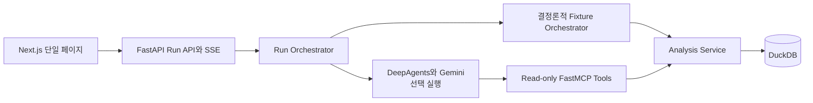

# 고객 Journey Agent MVP 설계

작성일: 2026-08-19

## 목표

사용자가 한국어 질문을 입력하면 Agent가 합성 고객 데이터를 조회합니다.
로컬 워킹데모는 분석 진행 과정과 근거가 연결된 Insight를 한 화면에서 보여줍니다.
사용자는 결과 고객을 선택해 채널 통합 Journey와 원본 Evidence를 확인할 수 있어야 합니다.

## 첫 데모 범위

첫 수직 슬라이스는 다음 질문에 답합니다.

> AI검색에서 해결하지 못하고 고객센터까지 문의한 고객이 얼마나 돼?

분석 패턴은 `검색 실패 → 동일 주제 재검색 → 72시간 내 VOC`입니다.
검색 이력, 검색 피드백, VOC 3개 Source만 사용합니다.
기간과 Source 토글을 바꿔 다시 실행할 수 있으며, 자유 입력은 같은 의도의 한국어 표현을 허용합니다.

데이터는 `seed=20260819`로 생성한 고객 30명과 2026-07-20부터 2026-08-18까지의 이벤트를 사용합니다.
정답 cohort는 6명으로 고정합니다.
나머지 고객에는 검색 성공, 재검색 없는 실패, 72시간 이후 VOC와 같은 near-miss를 섞습니다.

다음 기능은 이번 범위에서 제외합니다.

- 실제 사내 데이터 Connector와 실제 고객 식별자 연결
- 인증, 권한 관리, CRM Action 실행
- DeepAgents Subagent, 자유 SQL, 코드 실행, 파일 쓰기
- 장기 대화 기억과 여러 질문을 잇는 대화 상태
- Langfuse self-host, Golden Replay 대시보드, 운영 배포
- GA 행동과 가입 정보가 필요한 해지, 로밍 시나리오

## 제품 흐름

1. 사용자가 추천 질문을 선택하거나 같은 의도의 질문을 직접 입력합니다.
2. 사용자가 분석 기간과 포함 Source를 확인한 뒤 실행합니다.
3. UI가 계획, Tool 호출, 조회 Source, 처리 건수와 완료 상태를 SSE로 표시합니다.
4. 결과 영역이 고객 수, 주요 Topic, 패턴, 추천 Action과 Source별 기여도를 표시합니다.
5. 사용자가 고객 순위에서 한 명을 선택합니다.
6. UI가 해당 고객의 시간순 Journey를 표시합니다.
7. 사용자가 Journey 이벤트의 Evidence를 열어 마스킹된 원본 레코드를 확인합니다.
8. 사용자가 VOC Source를 끄고 다시 실행하면 탐지 고객과 근거가 달라집니다.

## 아키텍처

`GOOGLE_API_KEY`가 있고 `AGENT_MODE=gemini`이면 DeepAgents Coordinator가 MCP Tool을 선택합니다.
그 외에는 `AGENT_MODE=fixture`가 같은 Analysis Service를 정해진 순서로 호출합니다.
Fixture 모드는 화면에 표시해 실제 모델 실행으로 오해하지 않게 합니다.

MCP endpoint와 Tool contract는 두 모드에서 동일하게 유지합니다.
수치, 고객 매칭, Risk Score와 Evidence 선택은 Analysis Service가 계산합니다.
LLM이 계산한 값은 최종 결과로 사용하지 않습니다.

## 데이터 계약

Canonical Event는 다음 필드를 가집니다.

- `event_id`, `evidence_id`, `source_id`
- `occurred_at`, `event_type`, `action`
- `topic`, `outcome`, `text`
- `canonical_customer_id`
- `attributes`

Evidence는 `evidence_id`, Source, 이벤트 시각, 마스킹된 원본 필드와 설명을 가집니다. 고객 번호와 상담 식별자는 화면에 전체 값을 노출하지 않습니다.

Risk Score는 다음 규칙으로 계산합니다.

| Signal | 점수 |
| --- | ---: |
| 검색 실패 | 25 |
| 24시간 내 동일 Topic 재검색 | 25 |
| 부정 피드백 | 20 |
| 첫 검색 실패 후 72시간 내 동일 Topic VOC | 30 |

점수 구간은 `HIGH >= 75`, `MEDIUM >= 40`, `LOW < 40`으로 고정합니다. 정답 cohort는 검색 실패, 동일 Topic 재검색, 72시간 내 VOC를 모두 만족한 고객입니다.

## MCP Tool

- `catalog_sources`: 사용 가능한 Source와 기간, 건수 반환
- `aggregate_events`: Source, 이벤트 결과와 Topic별 집계 반환
- `match_journey_pattern`: 패턴을 만족한 고객과 Signal 반환
- `rank_customers`: Risk Score 순 고객 목록 반환
- `get_customer_journey`: 고객의 통합 Timeline 반환
- `get_evidence`: 선택한 Evidence의 마스킹된 원본 반환

모든 Tool은 `enabled_sources`, `start_at`, `end_at`을 입력으로 받습니다. Tool은 Raw SQL과 전체 테이블을 노출하지 않으며 최대 반환 건수를 제한합니다.

## API와 Run 상태

- `POST /api/runs`: 질문과 필터를 받아 `run_id` 생성
- `GET /api/runs/{run_id}/events`: `plan`, `tool_started`, `tool_completed`, `result`, `error`, `done` SSE 이벤트 제공
- `GET /api/runs/{run_id}`: 현재 상태와 최종 결과 제공
- `GET /api/runs/{run_id}/customers/{customer_id}/journey`: 선택 고객 Journey 제공
- `GET /api/runs/{run_id}/evidence/{evidence_id}`: Run이 참조한 Evidence 제공
- `GET /health`: 프로세스와 데이터 준비 상태 제공

Run registry는 단일 프로세스 메모리에 저장합니다.
이벤트와 결과는 데모 프로세스가 살아 있는 동안만 유지합니다.
SSE 재연결 시 `Last-Event-ID` 이후 이벤트부터 다시 보냅니다.

## UI 구조

UI는 단일 반응형 페이지로 구성합니다.

- 질문 Composer: 추천 질문, 자유 입력, 날짜 범위, Source 토글
- Live Trace: 계획 단계와 Tool 실행 상태
- Insight Summary: headline, 탐지 고객 수, 주요 Topic, Action
- Source Contribution: 활성 Source와 Signal 기여도
- Ranked Customers: 점수, 등급, Signal과 마지막 이벤트
- Customer Journey: 선택 고객의 시간순 이벤트
- Evidence Drawer: 키보드로 열고 닫을 수 있는 마스킹 원본 근거
- Demo Mode Badge: `Gemini Agent` 또는 `Fixture Replay` 상태

데스크톱에서는 결과와 Journey를 2열로 표시하고, 좁은 화면에서는 세로로 쌓습니다. 로딩, 빈 결과, 지원하지 않는 질문과 API 오류 상태를 각각 표시합니다.

## 오류 처리

- 지원하지 않는 질문: 지원 범위를 설명하고 추천 질문을 다시 제시
- Gemini 키 누락 또는 호출 실패: Run을 `fixture` 모드로 다시 실행하고 배지와 Trace에 전환 사유 표시
- Source 누락: 가능한 Source로 분석하되 결과에 제한 사항 표시
- 결과 없음: 0명 Insight와 필터 변경 안내 표시
- SSE 연결 해제: 같은 `run_id`와 마지막 이벤트 ID로 재연결
- Evidence 접근: 해당 Run 결과가 참조한 ID만 허용

## 검증 기준

- 고정 데이터에서 전체 Source 분석 결과가 정확히 6명을 반환
- VOC를 비활성화하면 정답 패턴 고객 수가 0명이며 검색 실패 후보만 별도 표시
- 모든 최종 고객 ID, metric과 Evidence ID가 같은 Run의 Tool 결과에 존재
- 질문 실행 후 진행 이벤트가 순서대로 표시되고 최종 결과로 전환
- 고객 선택 시 해당 고객의 Journey가 시간순으로 표시
- Evidence 선택 시 올바른 마스킹 원본 표시
- API key가 없어도 fixture 모드에서 전체 흐름 완료
- Backend 단위, 통합 테스트와 Frontend 컴포넌트 테스트 통과
- 실제 브라우저에서 데스크톱과 모바일 핵심 흐름 확인

## 기술 고정값

- Python `3.12`
- `deepagents==0.7.7`
- `langchain-mcp-adapters==0.3.2`
- `langchain-google-genai==4.3.4`
- `fastmcp==3.4.7`, `mcp==1.29.0`
- `fastapi==0.140.8`, `duckdb==1.5.5`
- Node.js `20.18.1`
- Next.js `16.3.x`, React `19.x`, TypeScript `5.x`
- Backend `http://localhost:8000`, Frontend `http://localhost:3000`

## 구현 원칙

- Domain과 Analysis 코드는 FastAPI, MCP, LLM에 의존하지 않습니다.
- 같은 Analysis Service를 MCP와 fixture orchestration이 공유합니다.
- 테스트가 데이터 정답과 Tool contract를 먼저 고정합니다.
- UI는 SSE의 공개 이벤트 contract에만 의존합니다.
- 생성 데이터와 Run trace 외의 파일을 런타임에 쓰지 않습니다.
