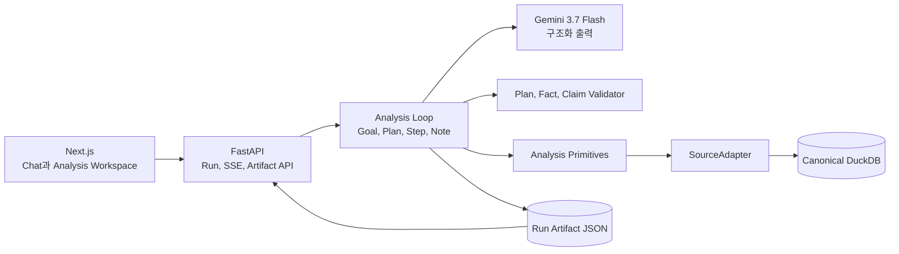

# 범용 고객 신호 분석과 실행 기록 설계

작성일: 2026-08-20

상태: 설계 승인

## 목표

사용자는 공통 고객 이벤트로 변환된 데이터에 자연어 분석 목표를 입력합니다.
Agent는 목표를 검증 가능한 분석 계획으로 바꾸고, 제한된 분석 Primitive를 조합해 고객 신호를 찾습니다.
화면은 각 단계의 확인 사실, 해석, 다음 분석 선택과 한계를 실시간으로 보여줍니다.
완료된 실행은 JSON 원본과 사람이 읽는 문서 View로 남아야 합니다.

이번 설계는 단일 `검색 실패 → 재검색 → VOC` 질문에 고정된 기존 MVP를 범용 분석 구조로 확장합니다.
질문의 표현만 넓히지 않고, 질문에서 분석 목표와 실행 계획을 만들 수 있어야 합니다.

## 범위

이번 프로토타입은 다음 기능을 구현합니다.

- 교체 가능한 `SourceAdapter` 계약
- Adapter가 만드는 `CanonicalCustomerEvent`, Identity Graph, `SourceManifest`
- 자연어 질문을 구조화하는 `AnalysisGoal`과 `AnalysisPlan`
- 집계, 추세, 세그먼트, 반복 행동, 전환, Sequence, Ranking, Journey 분석 Primitive
- 단계별 검증 Fact와 공개 `AnalysisNote`
- 왼쪽 Chat, 오른쪽 Analysis Workspace 화면
- 실행별 JSON Artifact와 문서 View, JSON/Markdown 다운로드
- 질문 모호성, Source 부족, 실행 실패와 검증 실패의 영속 기록

이번 프로토타입은 기존 합성 DuckDB Adapter 하나만 구현합니다.
원천 시스템별 Adapter 전체 구현은 범위에서 제외합니다.
테스트 전용 In-memory Adapter를 같은 계약에 적용해 교체 가능성을 검증합니다.

다음 기능도 제외합니다.

- 자유 SQL, 코드 실행과 파일 탐색 Tool
- 모델의 비공개 사고과정과 Provider 원문 공개
- Raw PII 저장과 마스킹되지 않은 원본 레코드 공개
- 운영 인증, 사용자별 권한, 조직 단위 보존 정책
- 외부 데이터베이스 Connector 전체 구현
- Langfuse와 외부 Observability 서비스
- 여러 Run의 대화 기억과 후속 질문 문맥 연결

## 사용 흐름

1. 사용자가 왼쪽 Chat에 자연어 분석 목표를 입력합니다.
2. Agent가 질문을 `AnalysisGoal`로 구조화합니다.
3. 질문이 모호하면 Agent가 분석을 실행하지 않고 확인 질문 하나를 반환합니다.
4. 사용자가 답하면 같은 Run이 Goal 생성을 다시 시도합니다.
5. Agent가 3~6단계 `AnalysisPlan`을 작성합니다.
6. 서버가 계획의 Source, 기간, Primitive, 비용 한도를 검증합니다.
7. 서버가 Primitive를 한 단계씩 실행해 typed Fact를 만듭니다.
8. 모델이 Fact를 참조하는 구조화 `AnalysisNote`와 다음 단계 선택을 반환합니다.
9. 서버가 Note를 검증한 뒤 SSE로 공개하고 JSON Artifact에 저장합니다.
10. 모든 단계가 끝나면 Agent가 최종 고객 신호 보고서를 작성합니다.
11. 사용자는 오른쪽에서 실행 기록과 보고서를 읽고 JSON 또는 Markdown으로 내려받습니다.
12. 사용자는 페이지를 새로고침한 뒤에도 이전 Run을 다시 열 수 있습니다.

## 질문 범위

지원 범위는 질문 문구 목록이 아니라 분석 Primitive로 표현할 수 있는 목표로 정합니다.
다음 질문은 서로 다른 계획을 만들어야 합니다.

- 최근 부정 피드백이 많은 Topic과 관련 고객 Segment를 알려줘.
- 같은 문제를 반복해서 찾은 뒤 고객센터까지 이동한 고객 흐름을 분석해 줘.
- 가입을 시작했지만 완료하지 못한 고객과 가장 많이 막힌 단계를 찾아줘.
- 최근 30일 동안 상담 전환율이 높아진 Source와 Topic을 비교해 줘.
- 해결 실패 신호가 누적된 고객을 근거와 함께 순위로 보여줘.

질문이 PII 조회, 원본 전체 추출, 쓰기 작업 또는 지원하지 않는 통계 기법을 요구하면 실행하지 않습니다.
Agent는 지원할 수 없는 이유와 가능한 질문 예시를 반환합니다.

## 아키텍처



`Analysis Loop`는 모델이 전체 실행을 임의로 제어하게 두지 않습니다.
모델은 구조화 Goal, Plan, Claim과 다음 단계 선택을 반환합니다.
서버는 허용된 Primitive만 실행하고, 각 결과를 검증한 뒤 공개합니다.

## Adapter와 공통 이벤트

`SourceAdapter`는 원천 스키마를 Agent가 직접 해석하지 않게 분리합니다.
Adapter는 다음 기능을 제공합니다.

```python
class SourceAdapter(Protocol):
    def describe(self) -> SourceManifest: ...
    def load_events(self, scope: EventScope) -> Iterable[CanonicalCustomerEvent]: ...
    def load_identities(self, scope: EventScope) -> Iterable[IdentityEdge]: ...
```

`CanonicalCustomerEvent`는 다음 의미 필드를 가집니다.

- 식별: `event_id`, `evidence_id`, `source_id`, `canonical_customer_id`
- 시간: `occurred_at`
- 행동: `event_type`, `action`, `topic`, `outcome`
- 범주값: `dimensions`
- 수치값: `measures`
- 근거: 마스킹 가능한 `text`, `attributes`

기존 Event 필드는 유지합니다.
`dimensions`와 `measures`는 범용 집계와 필터를 위한 추가 필드입니다.
Adapter는 원천 식별자를 Identity Graph로 연결해 정확히 하나의 `canonical_customer_id`로 해소해야 합니다.

## Source Manifest

`SourceManifest`는 모델과 계획 검증기가 사용할 데이터 사전입니다.

- `source_id`, 표시 이름, 설명
- 데이터 기간과 예상 갱신 주기
- 지원하는 `event_type`, `topic`, `outcome`
- 사용할 수 있는 `dimensions`와 `measures`
- 집계, Sequence, Ranking, Journey 등 지원 Capability
- PII 분류와 마스킹 정책
- Identity namespace와 연결 품질
- Adapter와 Manifest 버전

모델은 Manifest에 없는 필드, Capability와 Source를 계획에 넣을 수 없습니다.
원천 컬럼명은 모델과 분석 계획에 노출하지 않습니다.

## Analysis Goal과 Plan

`AnalysisGoal`은 질문의 의도를 다음 필드로 표현합니다.

- `objective`: 분석 목적
- `population`: 대상 고객 조건
- `time_range`: 반개구간 `[start_at, end_at)`
- `measures`: 계산할 값
- `group_by`: 비교할 차원
- `predicates`: Event와 고객 필터
- `sequence`: 순서와 시간 간격이 있는 행동 조건
- `output`: 집계, Segment, Ranking, Journey 등 결과 형태
- `clarification`: 실행 전 확인이 필요한 질문

`AnalysisPlan`은 3~6개의 `AnalysisStep`으로 구성합니다.
각 Step은 하나의 Primitive, 입력 Fact, 예상 출력과 종료 조건을 가집니다.
모델은 실행 중에 검증된 Plan의 미완료 Step 중 하나를 다음 단계로 선택합니다.
새 Fact 때문에 Plan을 바꿔야 하면 남은 Step만 수정한 `plan_revised`를 제출하고 서버 검증을 다시 받아야 합니다.
완료된 Step과 Fact는 수정할 수 없으며, 수정 뒤에도 전체 Step 수는 6개를 넘을 수 없습니다.

계획 검증기는 다음 조건을 확인합니다.

- Manifest에 있는 Source와 의미 필드만 사용
- 허용된 Primitive만 사용
- 최대 6단계
- 단계별 최대 반환 행, 전체 실행 시간과 Evidence 개수 제한
- 고유한 Step ID와 순환하지 않는 Fact 의존성
- PII, Raw export, 쓰기 작업 부재

## 분석 Primitive

| Primitive | 역할 | 주요 결과 |
| --- | --- | --- |
| `catalog_sources` | Source와 Capability 확인 | Source, 기간, 행 수, Manifest 버전 |
| `profile_events` | 분포와 데이터 품질 확인 | Topic, Outcome, 결측률, 고객 수 |
| `aggregate_events` | 집계와 추세 계산 | Metric, 시계열, Group bucket |
| `segment_customers` | 조건에 맞는 고객 집합 생성 | Segment ID, 고객 수, 조건별 기여 |
| `detect_repetition` | 반복 행동 탐색 | 고객, 반복 횟수, 시간 범위 |
| `match_sequence` | 전환과 Journey Sequence 탐색 | 후보, 완전 일치, 단계별 이탈 |
| `compare_segments` | 기간, Source, Cohort 비교 | 차이, 비율, 기준 Segment |
| `rank_customers` | 검증된 신호로 고객 순위 계산 | 고객, 점수, 신호, Evidence |
| `get_customer_journey` | 대표 고객 Timeline 조회 | 시간순 Event와 Evidence ID |
| `get_evidence` | 마스킹된 근거 조회 | Source, 고객, 시각, 안전한 필드 |

모든 Primitive는 typed 결과와 `result_id`를 반환합니다.
자유 SQL과 임의 원본 조회는 제공하지 않습니다.

## 단계별 AnalysisNote

오른쪽 패널은 모델의 비공개 사고과정을 표시하지 않습니다.
사용자에게는 검증 가능한 공개 분석 노트를 표시합니다.

```text
목표: 반복 실패 고객이 상담으로 전환되는지 확인
확인된 사실: 검색 실패 후보 24명, 완전한 Sequence 6명
해석: 후보 중 일부에서만 동일 Topic VOC 전환이 확인됨
다음 단계: 대표 고객 Journey와 Evidence 확인
한계: 요청 기간 밖 상담은 포함하지 않음
근거: result-..., evidence-...
```

`AnalysisNote`는 다음 구조를 가집니다.

- `step_id`, `status`, `objective`
- 서버 소유 `facts`
- 모델이 선택한 구조화 `claims`
- `next_step`, `limitations`
- `source_ids`, `result_ids`, `evidence_ids`
- 시작 시각, 완료 시각, 소요 시간

각 `Claim`은 `claim_type`, 비교 연산, 주제, 대상과 `fact_refs`를 가집니다.
서버가 Claim을 검증하고 사람이 읽는 문장으로 렌더링합니다.
모델이 같은 숫자를 다른 의미로 바꾸거나 존재하지 않는 Source와 고객을 인용할 수 없습니다.

## 최종 고객 신호 보고서

최종 보고서는 실행 질문에 따라 필요한 섹션만 포함합니다.

- 질문과 분석 범위
- Executive Summary
- 주요 Metric과 추세
- 발견한 고객 Signal과 Segment
- 고객 Ranking
- 대표 Journey
- Source별 기여와 Evidence
- 추천 Action
- 데이터와 분석 한계
- 계획, Tool, 모델, Dataset과 Manifest 버전

보고서는 `InsightReport`의 고정 Journey 문구를 제거하고 범용 `CustomerSignalReport`로 확장합니다.
모든 Metric, 고객, Source, Signal과 Evidence는 같은 Run의 Fact에 존재해야 합니다.

## SSE와 API

공개 SSE 이벤트는 다음과 같습니다.

- `run_started`
- `goal_created`
- `clarification_required`
- `plan_created`
- `plan_revised`
- `step_started`
- `fact_created`
- `analysis_note_created`
- `step_completed`
- `report_validating`
- `result`
- `error`
- `done`

기존 `tool_started`, `tool_completed` 이벤트는 호환 기간 동안 유지합니다.
Frontend는 새 Step 이벤트를 우선 사용합니다.

Artifact API는 다음 경로를 제공합니다.

- `GET /api/sources`: 선택 가능한 Source와 공개 Manifest 조회
- `GET /api/run-artifacts`: 최근 Run 목록
- `GET /api/run-artifacts/{run_id}`: JSON Artifact 조회
- `GET /api/run-artifacts/{run_id}/document`: 문서 View 데이터 조회
- `GET /api/run-artifacts/{run_id}/download.json`: JSON 다운로드
- `GET /api/run-artifacts/{run_id}/download.md`: Markdown 다운로드

모호한 질문에 답하는 API는 `POST /api/runs/{run_id}/clarification`입니다.
확인 답변은 해당 Run의 Goal 생성에만 사용하고 다음 Run의 대화 기억으로 남기지 않습니다.

## Run Artifact

JSON Artifact는 실행 중에도 Step이 끝날 때마다 원자적으로 갱신합니다.
경로는 `data/run-artifacts/{run_id}.json`입니다.
같은 디렉터리의 임시 파일을 완성한 뒤 `os.replace`로 교체합니다.

Artifact는 다음 정보를 저장합니다.

- `run_id`, 상태, 생성/완료 시각
- 원문 질문과 `AnalysisGoal`
- 기간과 활성 Source
- Dataset, Adapter, Manifest, Prompt, Model 버전
- 검증된 `AnalysisPlan`
- 공개 Fact와 `AnalysisNote`
- 최종 `CustomerSignalReport`
- 오류 코드, 실패 Step과 제한 사항

JSON을 단일 원본으로 사용합니다.
문서 View와 Markdown 다운로드는 JSON에서 생성합니다.
프로토타입은 Artifact를 자동 삭제하지 않습니다.

Artifact는 Provider 원문, 비공개 사고과정, Secret, Raw PII와 마스킹되지 않은 원본을 저장하지 않습니다.

## UI 구조

데스크톱 화면은 왼쪽 Chat과 오른쪽 Analysis Workspace의 2열 구조입니다.
모바일 화면은 같은 순서를 세로로 배치합니다.

왼쪽 영역은 다음 요소를 가집니다.

- 질문 대화와 확인 질문
- 기간과 Source 범위
- 범용 추천 질문
- 실행 상태
- 이전 Run 목록

오른쪽 영역은 다음 요소를 가집니다.

- 분석 목표와 계획
- 시간순 AnalysisNote 카드
- Fact, Source, 처리 건수, `result_id`와 Evidence 상세
- 진행 중, 실패, degraded 상태
- 문서형 최종 보고서
- JSON과 Markdown 다운로드

페이지 새로고침 시 실행 중 Run은 마지막 Event ID부터 SSE를 다시 연결합니다.
완료된 Run은 Artifact API에서 복원합니다.

## 오류 처리

- 모호한 질문: `clarification_required`와 확인 질문 하나 반환
- 지원할 수 없는 질문: 가능한 Primitive와 추천 질문 안내
- 빈 Source/기간: 결론 없이 limitation 기록
- Adapter/Manifest 불일치: 실행 전 실패와 버전 정보 기록
- Primitive 한도 초과: 해당 Step 실패와 부분 결과 기록
- 모델 시간 초과/Provider 오류: 결론 없이 Run 실패
- Claim/보고서 검증 실패: 공개 결과 없이 검증 오류 기록
- SSE 연결 해제: 같은 `run_id`와 마지막 Event ID로 재연결
- Artifact 쓰기 실패: Run 실패 처리와 메모리 이벤트 유지

범용 Run은 Provider 실패 시 기존 고정 Fixture 보고서로 전환하지 않습니다.
Fixture는 테스트와 사용자가 명시한 Demo 모드에서만 실행합니다.

## 보안과 경계

- 읽기 전용 Primitive와 Source allowlist
- 최대 6단계와 Tool별 반환 한도
- 요청 전체 시간 제한과 외부 취소 전파
- Raw SQL, 파일, Shell, 쓰기 Tool 비활성화
- Manifest 기반 PII 분류와 Evidence 마스킹
- Artifact와 SSE의 금지 키 검사
- 모델 출력의 숫자, ID, Source, 단위와 Claim 의미 검증
- Run이 실제로 참조한 Journey와 Evidence만 상세 조회 허용

## 검증 기준

Backend 계약 테스트는 다음 조건을 확인합니다.

- 합성 DuckDB Adapter와 테스트 전용 In-memory Adapter가 같은 공통 Event 계약을 충족
- Manifest에 없는 필드와 Capability를 Plan 단계에서 거부
- 계획의 단계 수, 시간, Source와 반환 한도 검증
- 각 Fact의 `result_id`, Metric, 고객, Source와 Evidence 연결
- Claim의 숫자, 단위, 의미, 고객과 Evidence 조작 차단
- Step 완료마다 Artifact 원자 저장
- 서버 재시작 뒤 Artifact 목록과 문서 복원
- 실패 Run의 부분 기록 보존

Frontend와 E2E는 다음 세 질문을 최소 수용 시나리오로 사용합니다.

1. 부정 피드백이 많은 Topic과 고객 Segment
2. 반복 행동 뒤 상담으로 전환되는 Journey
3. 가입 시작 뒤 완료하지 못한 고객과 이탈 단계

각 질문은 서로 다른 `AnalysisPlan`, Fact, AnalysisNote와 보고서를 만들어야 합니다.
합성 데이터는 세 목표가 서로 다른 결과와 근거를 만들 수 있도록 결정론적 패턴을 포함합니다.
사용자는 데스크톱과 모바일에서 실행 진행을 보고, 완료 기록을 다시 열고, JSON과 Markdown을 내려받을 수 있어야 합니다.

검증 순서는 다음과 같습니다.

1. Backend 단위와 계약 테스트
2. Frontend 계약과 컴포넌트 테스트
3. 데스크톱과 모바일 Playwright E2E
4. 실제 `gemini-3.7-flash` 1회 실행
5. 허위 숫자, Source, 고객, Evidence와 의미 변조 공격 테스트

## 구현 원칙

- Adapter, Canonical Event, Primitive와 검증기는 LLM Provider에 의존하지 않습니다.
- 모델은 분석 목표, 계획과 구조화 Claim을 선택하고 서버는 계산과 공개 문장을 소유합니다.
- 질문 지원 여부는 문장 정규식이 아니라 Manifest와 Primitive 표현 가능성으로 판단합니다.
- JSON Artifact가 실행 기록의 단일 원본입니다.
- 문서 View는 Artifact에서 파생하며 별도 사실을 추가하지 않습니다.
- 구현은 기존 API와 UI를 단계적으로 교체해 회귀 가능한 수직 Slice를 유지합니다.
